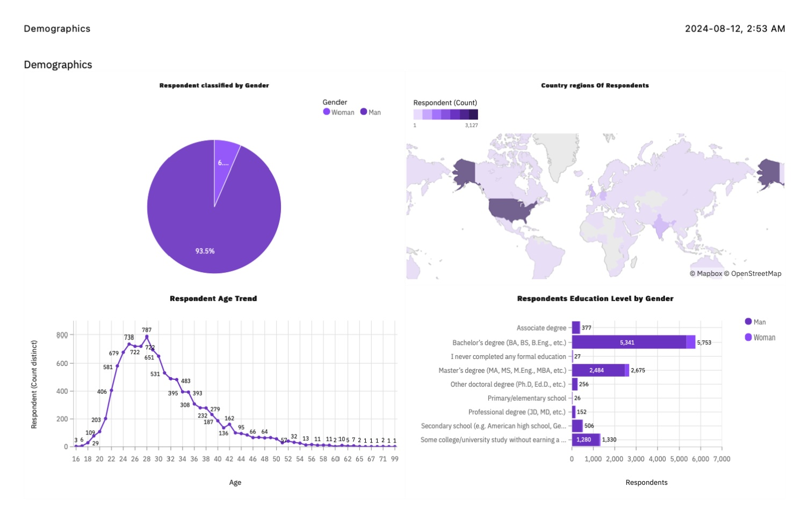

# IBM Data Analyst Capstone Project

## Overview

This project focuses on analyzing multiple datasets to uncover trends in emerging technologies. The goal is to derive actionable insights from the data that can inform decisions and strategies related to technology skills and industry demands.

---

## Modules

### Module 1: Data Collection

In this module, we gather data related to technology skills that are currently in demand from various sources.

**Sources:**
- Job Postings
- Blog Posts
- Surveys

**Methods:**
- **Collecting Data Using APIs**: Utilizing application programming interfaces to collect structured data.
- **Collecting Data Using Web Scraping**: Extracting data from web pages for analysis.

### Module 2: Data Wrangling

Prepare the collected data for analysis by cleaning and organizing it using various data wrangling techniques.

**Tasks:**
- **Finding and Handling Missing Values**
  - Determine and address missing values.
- **Finding and Removing Duplicates**
  - Identify and eliminate duplicate entries.
- **Normalizing Data**
  - Standardize data formats for consistency.

### Module 3: Exploratory Data Analysis (EDA)

Analyze the data to uncover patterns, trends, and insights. Key focus areas include:

- **Top Programming Languages in Demand**
- **Top Database Skills in Demand**
- **Most Popular Integrated Development Environments (IDEs)**
- **Demographic Data** (e.g., gender and age distribution of developers)

**Tasks:**
- Plot a distribution curve, and histogram.
- Find the median, and outliers of particular columns.
- Compute the Inter Quartile Range.
- Find out the upper and lower bounds, and find correlations between numerical columns.
- Create a new dataframe.

**Techniques:**
- **Distribution Analysis**
- **Outlier Detection**
- **Correlation Analysis**

### Module 4: Data Visualization

Create visual representations of the data to effectively communicate findings. Choose the appropriate type of visualization based on the data.

**Types of Visualization:**
- **Relationship**: Illustrate connections between variables.
- **Composition**: Show parts of a whole.
- **Comparison**: Contrast different data points.

Use Cognos to develop interactive dashboards that enable dynamic data exploration and presentation.

### Module 5: Dashboard Creation

Design and build interactive dashboards to visualize data insights in a user-friendly manner.

#### Dashboard Components

##### A. Current Technology Usage Tab

- **Top 10 Languages**
  - **Description:** Visualize the top 10 programming languages that respondents have worked with.
  - **Data Field:** `LanguageHaveWorkedWith`

- **Top 10 Databases**
  - **Description:** Visualize the top 10 databases that respondents have worked with.
  - **Data Field:** `DatabaseHaveWorkedWith`

- **Platforms**
  - **Description:** Visualize the different platforms respondents have worked with.
  - **Data Field:** `PlatformHaveWorkedWith`

- **Top 10 Web Frameworks**
  - **Description:** Visualize the top 10 web frameworks that respondents have worked with.
  - **Data Field:** `WebframeHaveWorkedWith`

  

##### B. Future Technology Trends Tab

- **Top 10 Languages Desired for the Next Year**
  - **Description:** Visualize the top 10 programming languages respondents desire to learn next year.
  - **Data Field:** `LanguageWantToWorkWith`

- **Top 10 Databases Desired for the Next Year**
  - **Description:** Visualize the top 10 databases respondents desire to learn next year.
  - **Data Field:** `DatabaseWantToWorkWith`

- **Desired Platforms for the Next Year**
  - **Description:** Visualize the platforms respondents desire to work with next year.
  - **Data Field:** `PlatformWantToWorkWith`

- **Top 10 Web Frameworks Desired for the Next Year**
  - **Description:** Visualize the top 10 web frameworks respondents desire to learn next year.
  - **Data Field:** `WebframeWantToWorkWith`

  

##### C. Demographics Tab

- **Respondent Count by Gender**
  - **Description:** Visualize the number of respondents classified by gender.
  - **Data Field:** `Gender`

- **Respondent Count for Countries**
  - **Description:** Visualize the number of respondents from different countries.
  - **Data Field:** `Country`

- **Respondent Count by Age**
  - **Description:** Visualize the number of respondents in different age groups.
  - **Data Field:** `Age`

- **Respondent Count by Gender and Classified by Education Level**
  - **Description:** Visualize respondents classified by gender and further categorized by their education level.
  - **Data Fields:** `Gender`, `EdLevel`

  

### Module 6: Presentation of Findings

Compile the results and insights into a final presentation to showcase your analysis and recommendations.

---
